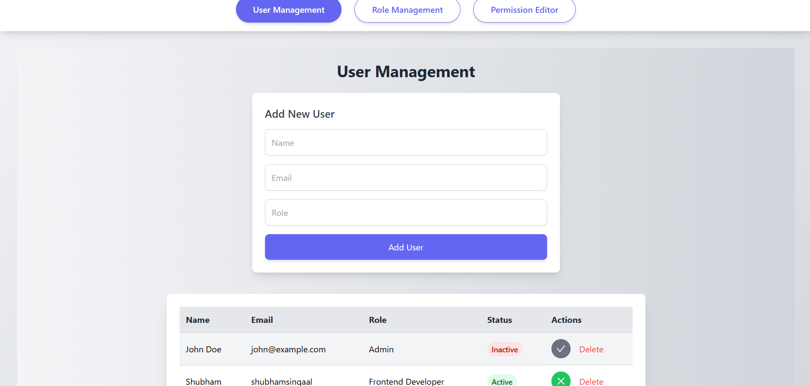

# **RBAC Admin Dashboard**

The **RBAC Admin Dashboard** is a React-based application designed for managing roles, users, and permissions in a role-based access control (RBAC) system. It uses **Vite** for fast builds and hot module replacement (HMR), and **Tailwind CSS** for styling.

---

## **Features**
- **User Management**:
  - Add, edit, and delete users.
  - Toggle user statuses between "Active" and "Inactive."
  - Interactive and user-friendly design.

- **Role Management**:
  - Add new roles with customizable permissions.
  - Edit existing roles and their associated permissions.
  - Delete roles with real-time updates.

- **Permission Editor**:
  - Assign or modify permissions for specific roles.
  - Intuitive checkbox interface for managing permissions.

- **Responsive Design**:
  - Fully responsive layout with consistent styles.
  - Optimized for both desktop and mobile devices.

- **Animations**:
  - Smooth transitions and hover effects using Tailwind CSS custom animations.

---

## **Tech Stack**
- **Frontend**: React (with Vite for fast development and builds).
- **Styling**: Tailwind CSS for consistent, modern design.
- **Icons**: React Icons for interactive UI elements.
- **State Management**: Context API for managing roles, users, and permissions.

---

## **Setup and Installation**

### **Prerequisites**
- **Node.js** (version 14 or higher recommended)
- **npm** or **yarn**

### **Installation**
1. Clone the repository:
   ```bash
   git clone https://github.com/your-username/rbac-admin-dashboard.git
   ```

2. Navigate to the project directory:
   ```bash
   cd rbac-admin-dashboard
   ```

3. Install dependencies:
   ```bash
   npm install
   ```

4. Start the development server:
   ```bash
   npm run dev
   ```

5. Open your browser and visit:
   ```
   http://localhost:5173
   ```

---

## **File Structure**
```
├── public/
├── src/
│   ├── components/
│   │   ├── UserManagement.jsx
│   │   ├── RoleManagement.jsx
│   │   ├── PermissionEditor.jsx
│   ├── context/
│   │   ├── RBACContext.jsx
│   ├── App.jsx
│   ├── main.jsx
├── tailwind.config.js
├── index.html
├── package.json
```

- **`components/`**: Contains all the React components (User Management, Role Management, and Permission Editor).
- **`context/`**: Contains the RBAC Context for managing roles, users, and permissions.
- **`tailwind.config.js`**: Tailwind CSS configuration for custom animations and themes.

---

## **Customization**

### **Add Custom Animations**
Modify the `tailwind.config.js` file to add custom animations like `fadeIn` or `slideDown`.

```javascript
module.exports = {
  theme: {
    extend: {
      animation: {
        fadeIn: 'fadeIn 0.5s ease-out',
        slideDown: 'slideDown 0.6s ease-out',
      },
      keyframes: {
        fadeIn: {
          '0%': { opacity: 0 },
          '100%': { opacity: 1 },
        },
        slideDown: {
          '0%': { transform: 'translateY(-20px)', opacity: 0 },
          '100%': { transform: 'translateY(0)', opacity: 1 },
        },
      },
    },
  },
};
```

---

## **Available Scripts**

### **Development**
```bash
npm run dev
```
Starts the development server with HMR.

### **Build**
```bash
npm run build
```
Creates an optimized production build.

### **Preview**
```bash
npm run preview
```
Previews the production build locally.

---

## **License**

This project is licensed under the MIT License.

---

## **Contributions**

Contributions are welcome! Please fork the repository and create a pull request with your proposed changes.

---

## **Screenshots**

### **Dashboard Overview**


### **User Management**


### **Role Management**


### **Permission Editor**


---

## **Acknowledgments**
- **Vite**: For a blazing-fast development experience.
- **Tailwind CSS**: For a modern and responsive UI framework.
- **React Icons**: For beautifully styled and customizable icons.

